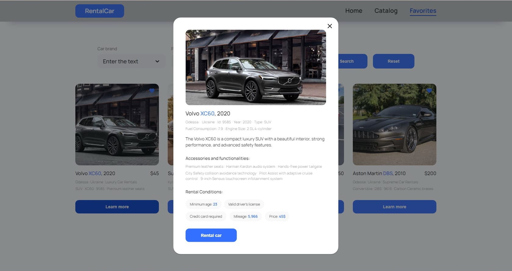

# Rental Car App

The RentalCar application, which provides services for the provision of cars for rent in Ukraine.

(This is a simple program designed as a test project.)

[Project Link](https://serhiirepinskyi.github.io/test-rental-car/)

## Review

The application consists of three main pages.

### Home page

Home page with a general description of the services provided by the company.


### Catalog page

A page containing a catalog of cars of various configurations, which the user can filter by brand, price per hour of car rental and the number of kilometers covered by the car during its operation (mileage).


### Favorites page

A page with ads that have been added to favorites by the user.


### Modal window

Modal window with rental conditions and detailed characteristics of the selected car.



## Technologies Used

Frontend:
- React
- React Router Dom
- Redux Toolkit
- Redux Persist
- React-select
- Axios
- Styled Components
- Notiflix and other

Backend:
- Mockapi.io

## Installation

This project was bootstrapped with [Create React App](https://github.com/facebook/create-react-app).

Follow these steps to set up and run the RentalCar App locally:

1. Clone this repository to your local machine:

   ```bash
   git clone https://github.com/SerhiiRepinskyi/test-rental-car.git
   ```

2. Navigate to the project folder: `cd your-repo-name`
3. Install dependencies: `npm install`
4. Start the application: `npm start`

## Author

Created by **Serhii Repinskyi**

- **GitHub**: [SerhiiRepinskyi](https://github.com/SerhiiRepinskyi)
- **LinkedIn**: [Serhii Repinskyi](http://www.linkedin.com/in/serhii-repinskyi)


## License

This project is licensed under the MIT License.
